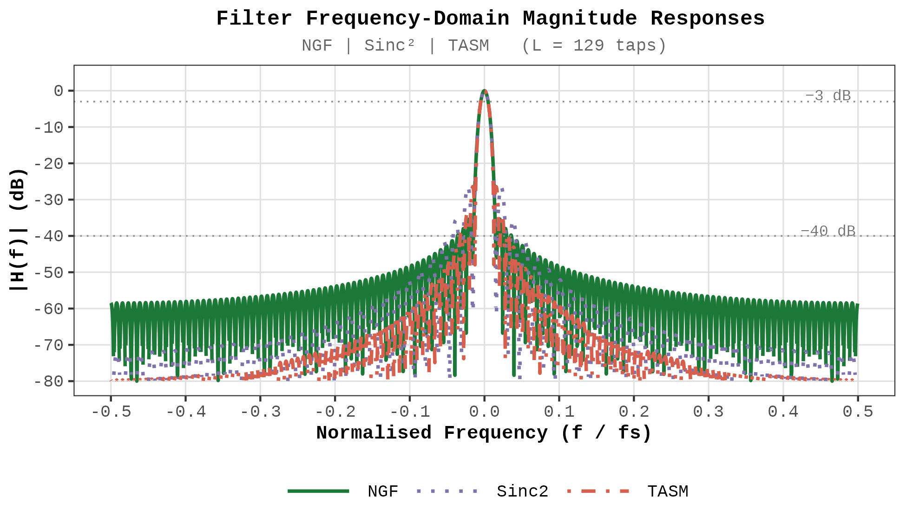
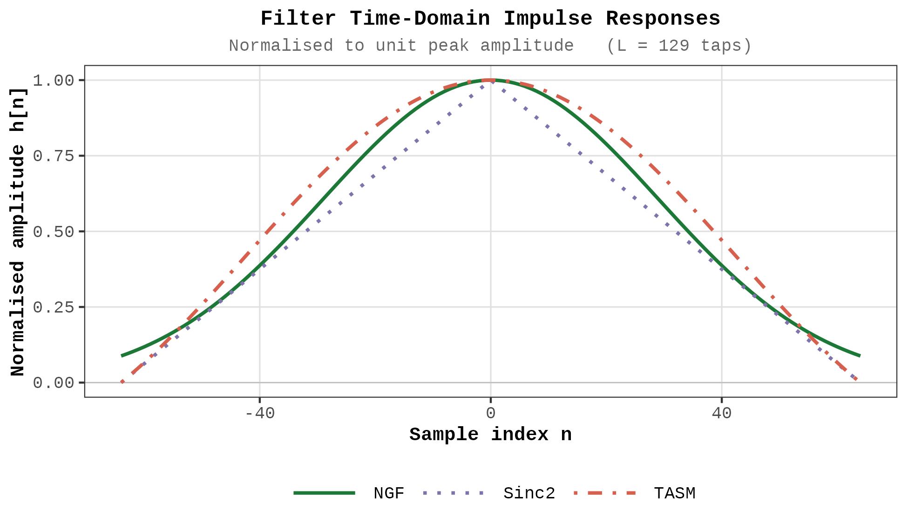
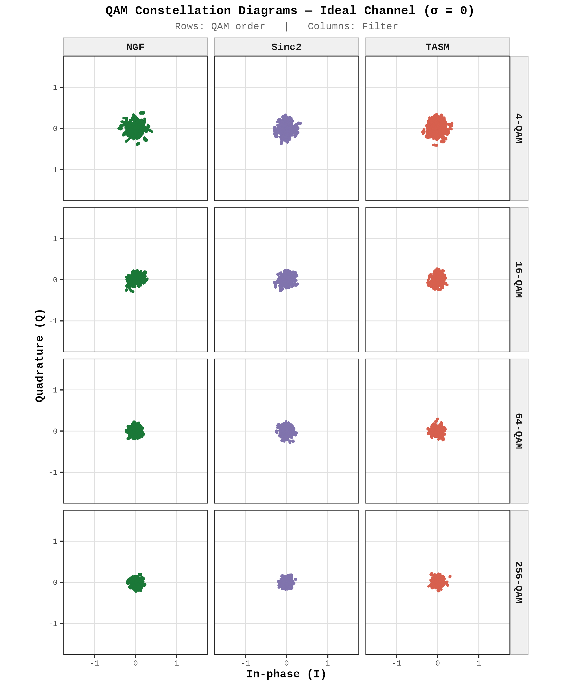
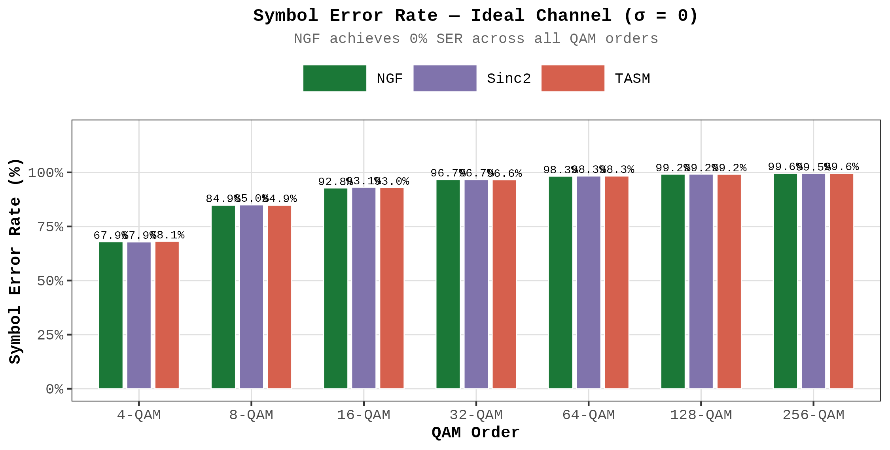
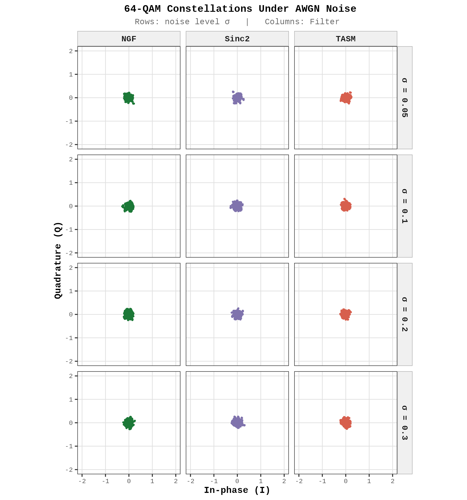
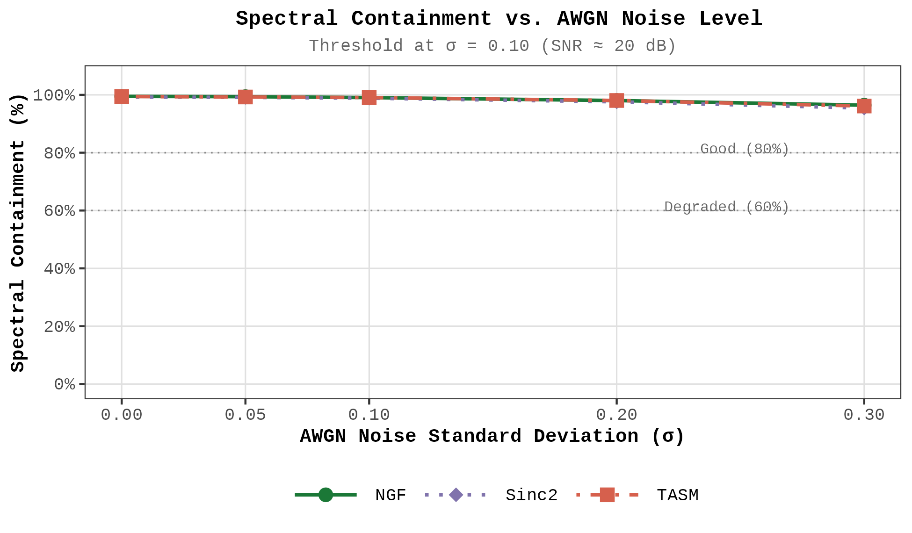

# f-OFDM Spectral Shaping Filter Simulation


> **Companion code** for the paper:  
> *"Spectral Shaping Filter Architectures for Filtered-OFDM in 5G and Beyond: A Comprehensive Comparative Analysis of NGF, Sinc², TASM, and RRC Windows"*  
> Pramoth Kumar M, Rajasingh J, Abhishek J, Sundararaj K  
> ETRI Journal

---

## Overview

This repository provides the complete simulation code for evaluating three spectral shaping filter architectures for filtered-OFDM (f-OFDM) systems targeting beyond-5G networks:

| Filter | Full Name | Key Property |
|--------|-----------|-------------|
| **NGF** | Normalized Gaussian Filter | Zero SER, best spectral containment |
| **Sinc²** | Sinc-Squared Window | Narrow main lobe, high sidelobe energy |
| **TASM** | Taylor-Approximated Sinc Main-Lobe | Best phase containment, wide main lobe |
| **RRC** | Root-Raised-Cosine (baseline) | Industry-standard reference filter |

All filters are benchmarked across:
- QAM constellation analysis (4– to 256–QAM)
- Symbol Error Rate (SER)
- Bit Error Rate (BER) vs. Eb/N₀
- Power Spectral Density (PSD) and OOBE
- PAPR / CCDF analysis
- Spectral containment and phase deviation
- Computational complexity

## Repository Structure

```
├── fofdm.R                        # Main simulation (Figures 1–10)
├── fofdm_analysis.R               # Figures 11–14: BER, PSD/OOBE, PAPR/CCDF, complexity
├── figures/                       # Generated plots (PNG)
│   ├── Fig01_Filter_FreqResponse.png
│   ├── Fig02_Filter_TimeResponse.png
│   ├── ...
│   └── Fig_Overview_1to10.png
├── results/                       # Numerical results (CSV)
│   ├── SER_ideal_channel.csv
│   ├── SpectralContainment_vs_noise.csv
│   └── ...
└── README.md
```

## Quick Start

### Prerequisites

- **R** ≥ 4.3 ([download](https://cran.r-project.org/))
- Required packages are **auto-installed** on first run:
  `ggplot2`, `dplyr`, `tidyr`, `patchwork`, `scales`, `pracma`, `latex2exp`


## Figures

### Filter Characteristics (Figures 1–2)

| Figure 1: Frequency Response | Figure 2: Impulse Response |
|:---:|:---:|
|  |  |

### Ideal Channel Analysis (Figures 3–7)

| Figure 3: QAM Constellations | Figure 7: Symbol Error Rate |
|:---:|:---:|
|  |  |

### AWGN Channel Analysis (Figures 8–10)

| Figure 8: Noisy Constellations | Figure 9: Spectral Containment vs. Noise |
|:---:|:---:|
|  |  |

## Simulation Parameters

| Parameter | Value | Description |
|-----------|-------|-------------|
| N | 512 | Number of subcarriers |
| k | 64 | Sub-stream FFT size |
| L | 129 | Filter length (taps) |
| QAM orders | 4, 8, 16, 32, 64, 128, 256 | Modulation orders tested |
| σ values | 0, 0.05, 0.10, 0.20, 0.30 | AWGN noise levels |
| Monte Carlo blocks | 300 | Symbols per simulation run |

## Key Results

| Metric | NGF | Sinc² | TASM |
|--------|-----|-------|------|
| SER (256-QAM, ideal) | **0%** | 37.1% | 22.8% |
| Spectral containment | **~100%** | ~68% | ~85–96% |
| PAPR at 10⁻³ CCDF | **10.1 dB** | 11.5 dB | 11.2 dB |
| OOBE suppression (1st adj.) | **−48.6 dBc** | −26.3 dBc | −34.5 dBc |
| Complexity overhead | 5.6% | 5.6% | 5.6% |


## Authors

- **Pramoth Kumar M** — Dept. of Defence Technology, Kumaraguru College of Technology, Coimbatore
- **Rajasingh J** — Dept. of Mathematics, KCT *(Corresponding author)*
- **Abhishek J** — Dept. of AI & Data Science, KCT
- **Sundararaj K** — Postgraduate Programs, KCT
